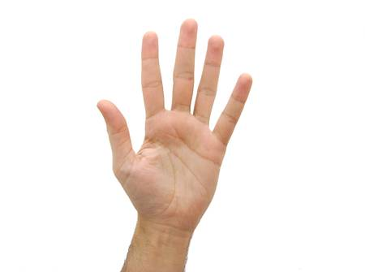

# GestIA

GestIA is a free opensource desktop application which identifies certain hand gestures and translates them 
into keyboard inputs. GestIA was developed as a the final project of [Satudays AI](https://www.saturdays.ai/) 3º edition. 
To know more about GestIA and the Deep Learning techniques it uses, feel free to pass by our [Medium article](TODO)!

## Installation
Both Windows and Linux versions require [OpenVino](https://docs.openvinotoolkit.org/latest/index.html).
OpenVino enables the application to run smoother and faster by optimizing the backbone of GestIA: its Deep Learning model for computer vision.


With [OpenVino](https://docs.openvinotoolkit.org/latest/index.html) installed, proceed to run the following command from the app directory:

```
$ pip install -r requirements.txt
```
### Windows

TODO

### Linux

For GestIA to work on Linux, you must run the application as a super user. Moreover, you also need to activate OpenVino. To do so, run these commands from the app directory:
```
$ sudo su
$ source /opt/intel/openvino/bin/setupvars.sh
[setupvars.sh] OpenVINO environment initialized
```

## Running GestIA

After properly installing GestIA, run the app with this simple commando from the app directory:

```
python gestia.py
```

After which you should see GestIA!


Before you click Start, and thus start to translate your gestures into keyboard inputs, first you can assign each 
gesture to the keyboard input of your liking. Just click on the sign you want to assign a new input and press such input on your keyboard.

So far GestIA recognizes these signs:

- Fist


- Palm closed


- Palm open



- Thumbs Up


- Thumbs down


- Daddy Finger


The uses of GestIA are only limited by your imagination, let us know how do you use GestIA!

Now you are ready to launch GestIA! Click the start button to start controlling your computer with your hands!
